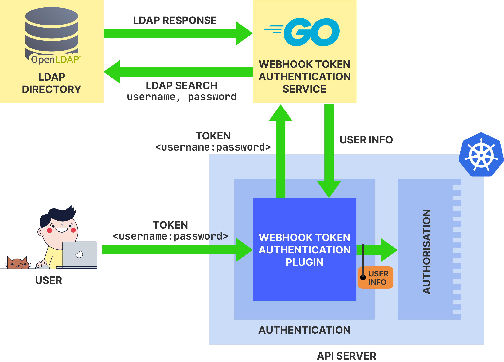

# Kubernetes LDAP authentication

This respository is part of the [_Authentication_](https://academy.learnk8s.io/authentication-intro) course of the [Learnk8s Academy](http://academy.learnk8s.io/).

## Contents

- [`authn.go`](authn.go): webhook token authentication service
- [`infra.sh`](infra.sh): automation script for creating and deleting the GCP infrastructure for the LDAP directory, webhook token authentication service, and Kubernetes cluster

## Overview

